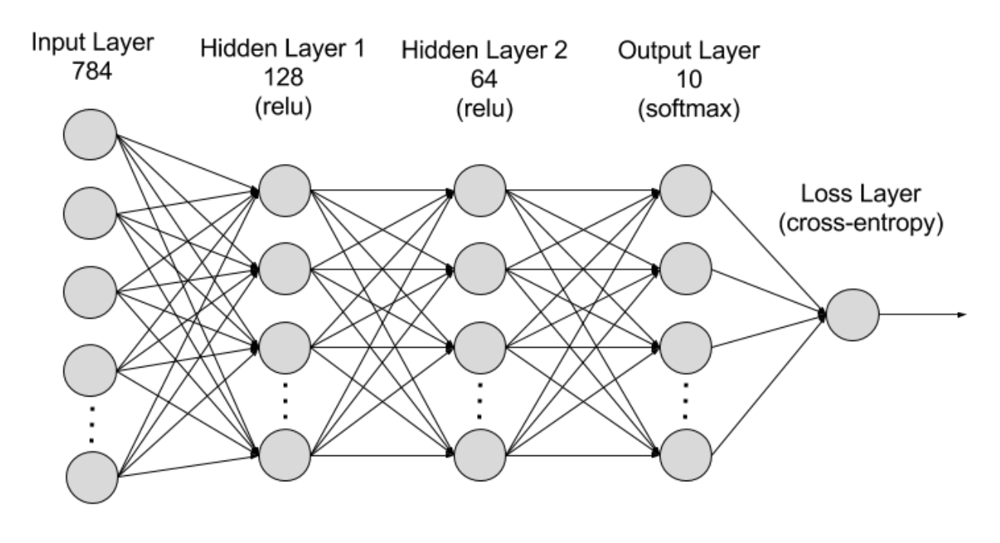

# Handwritten digits recognition

#### The app uses the neural network of following structure to predict a digit between 0 and 9



#### The app receives a set of n images of 28x28 pixels as a matrix of shape (n x 784)

#### Build an image of a docker container:
```sh
docker build -t digits_net .
```
#### Run container:
```sh
docker run -d -p 8181:8181 -v <path_to_your_models_dir>:/app/app/models digits_net
```


